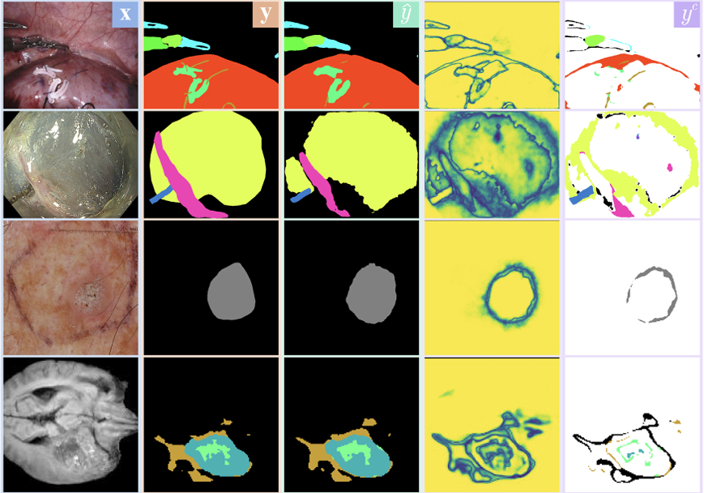

# License and Link to Code for Error Correcting Mean Teacher

## Abstract
Semantic segmentation is an essential task in medical imaging research. Many powerful deep-learning-based approaches can be employed for this problem, but they are dependent on the availability of an expansive labeled dataset. In this work, we augment such supervised segmentation models to be suitable for learning from unlabeled data. Our semi-supervised approach, termed Error-Correcting Mean-Teacher, uses an exponential moving average model like the original Mean Teacher but introduces our new paradigm of error correction.

The original segmentation network is augmented to handle this secondary correction task. Both tasks build upon the core feature extraction layers of the model. For the correction task, features detected in the input image are fused with features detected in the predicted segmentation and further processed with task-specific decoder layers. The combination of image and segmentation features allows the model to correct present mistakes in the given input pair. The correction task is trained jointly on the labeled data. On unlabeled data, the exponential moving average of the original network corrects the student's prediction. The combined outputs of the students' prediction with the teachers' correction form the basis for the semi-supervised update.

We evaluate our method with the 2017 and 2018 Robotic Scene Segmentation data, the ISIC 2017 and the BraTS 2020 Challenges, a proprietary Endoscopic Submucosal Dissection dataset, Cityscapes, and Pascal VOC 2012. Additionally, we analyze the impact of the individual components and examine the behavior when the amount of labeled data varies, with experiments performed on two distinct segmentation architectures. Our method shows improvements in terms of the mean Intersection over Union over the supervised baseline and competing methods.



## Performance
| Dataset     | Method                                     | 6.25%  | 12.5%  | 25%    | 50%    |
|-------------|--------------------------------------------|--------|--------|--------|--------|
| Cityscapes  | **CCT**<sup>†</sup>                        | 66.35  | 72.46  | 75.68  | 76.78  |
|             | **CPS**<sup>†</sup>                        | 69.79  | 74.39  | **76.85** | **78.64** |
| *           | **ECMT**                                   | **71.19** | **75.18** | 76.73  | 77.84  |
| Pascal VOC 2012 | **CCT**<sup>†</sup>                    | 65.22  | 70.87  | 73.43  | 74.49  |
|             | **CPS**<sup>†</sup>                        | 68.21  | 73.20  | 74.24  | **75.91** |
| *           | **ECMT**                                   | **71.48** | **73.37** | **74.95** | 75.53  |

> For ECMT, the average mIoU of the last ten epochs is reported. The results for methods marked with † are taken from the CPS publication.

## Code

### Licensing
Due to licensing agreements, accessing the code requires agreeing to the license at https://semisup.re-mic.de/.
A download link will be provided afterwards.

### Environment
The repository provides a Dockerfile and a build script.
In the build script `scripts/container.sh`, the following paths need to be set to point to the data and snapshot folders:

```bash
DATA=/path/to/Datasets/
SNAPSHOTS=/path/to/snapshots/$PNAME
CACHE=/path/to/pretrained/weights
```

The repository provides pretrained weights for a ResNet50 model, used in the paper.

### Training
The repository includes the implementation for training on the `Cityscapes` dataset.
After successful execution of the build script `container.sh`,
scripts/cityscapes.sh can be called with `GPUID` and the chosen ratio of labeled training data, for example, `0.125`.

Checkpoints and a TensorBoard event file will be stored in the `$SNAPSHOTS` folder.